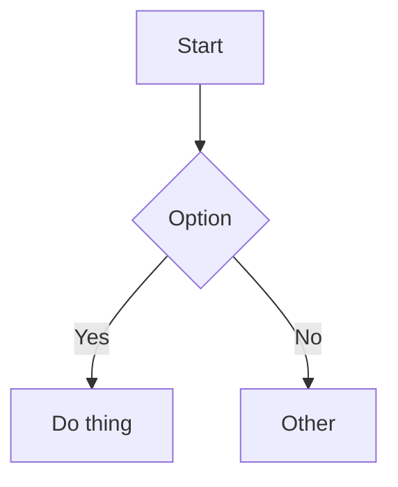

# hugo-trainsh - Usage Guide

This document covers installation, content structure, shortcodes, and markdown features for the `hugo-trainsh` theme.

## Table of contents

- [Installation](#installation)
- [Required site configuration](#required-site-configuration)
- [Content structure](#content-structure)
- [Navigation](#navigation)
- [Shortcodes](#shortcodes)
- [Code blocks](#code-blocks)
- [Mermaid diagrams](#mermaid-diagrams)
- [Math (inline + block)](#math-inline--block)
- [Images + PhotoSwipe lightbox](#images--photoswipe-lightbox)
- [Customization](#customization)

## Installation

### As a Git submodule (recommended)

```bash
git submodule add https://github.com/binbinsh/hugo-trainsh themes/hugo-trainsh
git submodule update --init --recursive
```

In your site config:

```toml
theme = "hugo-trainsh"
```

### As a Hugo module (optional)

```toml
[module]
  [[module.imports]]
    path = "github.com/binbinsh/hugo-trainsh"
```

## Required site configuration

### Set your main content sections

The theme lists posts from `params.mainSections`.
Set this to the section(s) where your articles are stored.

```toml
[params]
mainSections = ["posts"]
```

Examples:

- If posts live in `content/posts/`, use `["posts"]`
- If posts live in `content/blog/`, use `["blog"]`
- If both are used, use `["posts", "blog"]`

### Optional: enable JSON output

The theme ships `layouts/index.json` for JSON indexing.
Enable this if you need JSON output (for example, custom client-side search).

```toml
[outputs]
home = ["HTML", "RSS", "JSON"]
```

## Content structure

### Blog page (`/blog/`)

Create:

```text
content/
  blog/
    _index.md
```

The `/blog/` page is rendered as a year-grouped archive.
Content from `content/blog/_index.md` is shown at the top when provided.

### Posts

Put posts in sections listed in `params.mainSections`, for example:

```text
content/
  posts/
    my-post.md
```

### Tags

Tag taxonomy pages are available at:

- `/tags/` (all tags)
- `/tags/<term>/` (term archive)

## Navigation

Navigation sources, in priority order:

1. `params.nav` (a markdown string rendered into links)
2. `menu.main`
3. Theme fallback links

Example:

```toml
[params]
nav = "[Home](/) [Now](/now/) [Projects](/projects/) [Blog](/blog/)"
```

## Shortcodes

### Table of contents

TOC is opt-in. Insert where you want it:

```md

```

The rendered TOC includes H2/H3 headings.

### Tags

Render a taxonomy term list inside content:

```md



```

### Recent posts

Render a recent post list:

```md


```

Defaults:

- `limit` -> `params.home.recent.limit` or `5`
- `title` -> localized `home_most_recent_posts`

## Code blocks

Use fenced code blocks with language labels:

````md
```javascript
export function greet(name) {
  return `Hello, ${name}!`;
}
```
````

Theme behavior:

- Hugo syntax highlighting
- Copy button
- Soft-wrap toggle

## Mermaid diagrams

Use fenced Mermaid blocks:

````md

````

Mermaid is loaded only when Mermaid content is present.

## Math (inline + block)

### Block math (theme-native)

````md
```passthrough
E = mc^2
```
````

### Inline + block math with Goldmark passthrough (recommended)

Enable Goldmark passthrough in your config:

```toml
[markup]
  [markup.goldmark]
    [markup.goldmark.extensions]
      [markup.goldmark.extensions.passthrough]
        enable = true
        [markup.goldmark.extensions.passthrough.delimiters]
          block = [['$$', '$$'], ['\\[', '\\]']]
          inline = [['$', '$'], ['\\(', '\\)']]
```

Then write:

- Inline: `$a^2 + b^2 = c^2$`
- Block: `$$E = mc^2$$`

KaTeX assets are loaded only when math is detected.

## Images + PhotoSwipe lightbox

Markdown images are rendered as `<figure>` and wrapped for lightbox behavior:

```md
")
```

Clicking the image opens a PhotoSwipe lightbox.

### Best practice: page bundles for local images

```text
content/posts/my-post/
  index.md
  my-image.jpg
```

In `index.md`:

```md

```

When the image is a page resource, intrinsic dimensions are emitted in markup for better lightbox UX.

## Customization

### Styling

Main stylesheet:

- `assets/css/style.css`

Useful variables (Light/Dark themes):

```css
:root {
  --width: 760px;
  --font-main: Verdana, sans-serif;
  --font-secondary: Verdana, sans-serif;
  --font-mono: ui-monospace, SFMono-Regular, "SF Mono", Menlo, Consolas, "Liberation Mono", monospace;
  --background-color: #fafafa;
  --text-color: #444;
  --heading-color: #1a1a1a;
  --link-color: #0066cc;
  --accent-color: #0077cc;
}
```

The retro theme overrides these via `[data-theme="retro"]` and adds its own variables:

```css
[data-theme="retro"] {
  --background-color: #00237C;   /* NES deep blue */
  --dialog-bg: #000000;          /* dialog/code block background */
  --dialog-border: #FCFCFC;      /* white pixel border */
  --gold-color: #F8B800;         /* RPG gold for tags/highlights */
  --pixel-shadow: 3px 3px 0 #000000;
}
```

### Theme mode

The theme ships three visual modes that cycle on each click of the header toggle button:

**Retro** → **Light** → **Dark** → Retro …

| Mode | Icon | Description |
|------|------|-------------|
| Retro | Gamepad | **Default.** NES/FC pixel-art style — deep-blue background, white pixel borders, Fusion Pixel font, NES palette syntax highlighting |
| Light | Sun | Clean light palette |
| Dark | Moon | Clean dark palette |

The active mode is stored in `localStorage` and restored on page load. When no preference is stored, **Retro mode is used by default**.

#### Changing the default style

Set `params.defaultColorScheme` to choose the initial visual mode for first-time visitors (before they toggle):

```toml
[params]
defaultColorScheme = "light"   # "retro" (default), "light", or "dark"
```

Omit or leave empty to keep the default (`retro`). Returning visitors who have already toggled are unaffected — their `localStorage` preference takes priority.

The retro theme uses the **Fusion Pixel 12px** pixel font for headings and UI elements, with per-language font variants automatically selected:

- English / Simplified Chinese: `fusion-pixel-12px.woff2`
- Traditional Chinese: `fusion-pixel-12px-zh-hant.woff2`
- Japanese: `fusion-pixel-12px-ja.woff2`

Font files are only preloaded when the retro theme is active (removed via inline script otherwise).

### Social links

```toml
[params.social]
github = "https://github.com/yourname"
x = "https://x.com/yourname"
linkedin = "https://www.linkedin.com/in/yourname"
email = "hello@yourdomain.com"
```

These links appear in the footer.
