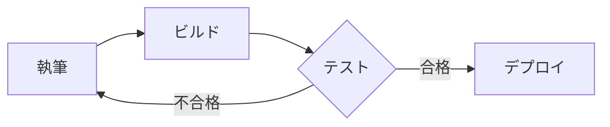

+++
title = 'テーマガイド'
date = '2025-10-26'
draft = false
tags = ['ガイド','テーマ','mermaid','数学']
translationKey = 'quick-start'
+++

この記事では **hugo-trainsh** の描画機能を紹介します——見出し、コード、テーブル、図、数式、画像など。



## 3つのテーマモード

ヘッダーのトグルボタンで順に切り替えます：

1. **レトロ** (ゲームパッド) — NES ディープブルー背景、ピクセルフォント見出し、8-bit ダイアログ枠
2. **ライト** (太陽) — すっきりしたモダン配色
3. **ダーク** (月) — 夜間の閲覧に最適

## テキスト

通常の Markdown がそのまま使えます。**太字**はレトロモードでゴールドに、*斜体*も問題なく表示されます。[任意のリンク](/)もテーマに合わせてスタイルが変わります。

> 引用ブロックはレトロモードでシアンの枠が付き、長い記事でもすぐ見分けがつきます。

---

## コード

フェンスコードブロックにはシンタックスハイライト、コピーボタン、ソフトラップが付きます：

```python
from datetime import date

def greet(name: str) -> str:
    return f"こんにちは、{name}！今日は {date.today()} です。"

print(greet("世界"))
```

`hugo server` のようなインラインコードもスタイル付きです。

## テーブル

| コマンド | 説明 |
|---|---|
| `hugo server` | ローカル開発サーバーを起動 |
| `hugo` | 静的サイトをビルド |
| `hugo new posts/hello.md` | 新しい記事を作成 |

## 図表

Mermaid 図表はインラインで描画されます：



## 数式

$$E = mc^2$$

## 画像

クリックでライトボックスが開きます：


## タグ




