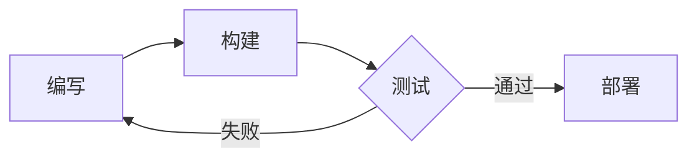

+++
title = '主题指南'
date = '2025-09-21'
draft = false
tags = ['指南','主题','mermaid','数学','短代码']
translationKey = 'quick-start'
+++

这篇文章展示 **hugo-trainsh** 的主要渲染能力——标题、代码、表格、图表、公式、图片等。



## 三种主题模式

点击页头的切换按钮依次切换：

1. **复古** (手柄) — NES 深蓝底色、像素字体标题、8-bit 对话框边框
2. **明亮** (太阳) — 干净的现代浅色方案
3. **暗黑** (月亮) — 适合夜间阅读

## 文字排版

常规 Markdown 正常渲染。**粗体**在复古模式下以金色高亮，*斜体*同样清晰可读。可以添加[任意链接](/)，样式会跟随主题变化。

> 引用块在复古模式下有独立的青色边框，在长文中一眼可辨。

---

## 代码

围栏代码块支持语法高亮、复制按钮和自动换行：

```python
from datetime import date

def greet(name: str) -> str:
    return f"你好, {name}！今天是 {date.today()}。"

print(greet("世界"))
```

行内代码如 `hugo server` 也有对应样式。

## 表格

| 命令 | 说明 |
|---|---|
| `hugo server` | 启动本地开发服务器 |
| `hugo` | 构建静态站点 |
| `hugo new posts/hello.md` | 创建新文章 |

## 图表

Mermaid 图表直接渲染：



## 数学公式

$$S = \pi r^2$$

## 图片

点击可打开灯箱查看大图：


## 标签




