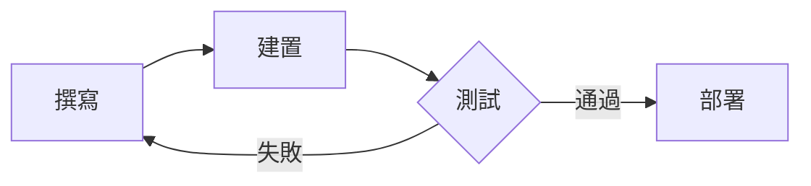

+++
title = '主題指南'
date = '2025-10-26'
draft = false
tags = ['指南','主題','mermaid','數學','短代碼']
translationKey = 'quick-start'
+++

這篇文章展示 **hugo-trainsh** 的主要渲染能力——標題、程式碼、表格、圖表、公式、圖片等。



## 三種主題模式

點擊頁首的切換按鈕依次切換：

1. **復古** (手把) — NES 深藍底色、像素字體標題、8-bit 對話框邊框
2. **明亮** (太陽) — 乾淨的現代淺色方案
3. **暗黑** (月亮) — 適合夜間閱讀

## 文字排版

常規 Markdown 正常渲染。**粗體**在復古模式下以金色高亮，*斜體*同樣清晰可讀。可以新增[任意連結](/)，樣式會跟隨主題變化。

> 引用區塊在復古模式下有獨立的青色邊框，在長文中一眼可辨。

---

## 程式碼

圍欄程式碼區塊支援語法高亮、複製按鈕與自動換行：

```python
from datetime import date

def greet(name: str) -> str:
    return f"你好, {name}！今天是 {date.today()}。"

print(greet("世界"))
```

行內程式碼如 `hugo server` 也有對應樣式。

## 表格

| 指令 | 說明 |
|---|---|
| `hugo server` | 啟動本地開發伺服器 |
| `hugo` | 建置靜態站點 |
| `hugo new posts/hello.md` | 建立新文章 |

## 圖表

Mermaid 圖表直接渲染：



## 數學

$$E = mc^2$$

## 圖片

點擊可開啟燈箱查看大圖：


## 標籤




